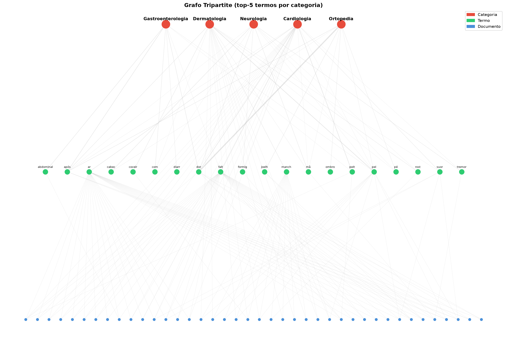
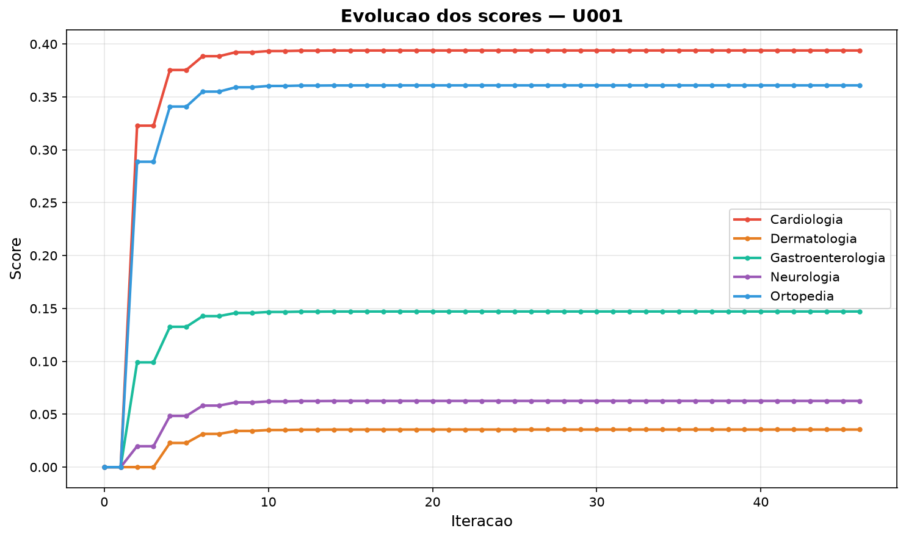
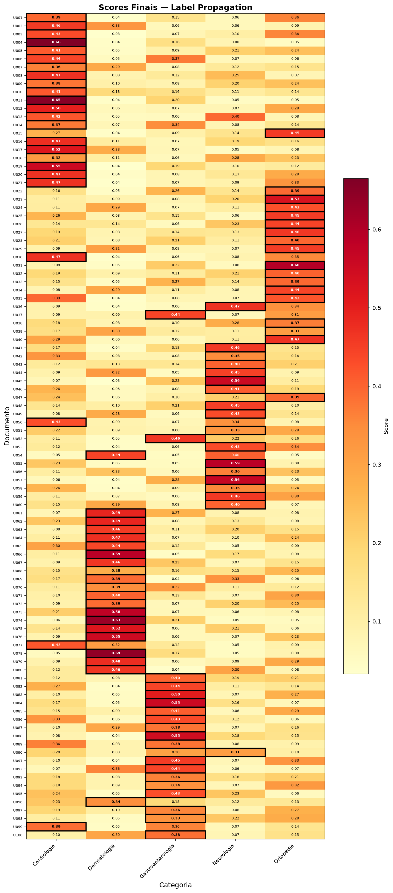

# Visualizações — GraphTriage-EDA

Esta pasta reúne os três gráficos gerados automaticamente por
[`src/visualizacao.py`](../../src/visualizacao.py) ao rodar `python main.py`.
Eles tornam visível **como o grafo está estruturado** e **como o Label
Propagation chega à classificação**. Abaixo, o que cada um mostra e a conclusão
que se extrai dele.

---

## 1. Grafo tripartite — [`grafo.png`](grafo.png)



**O que mostra.** A estrutura do grafo em três camadas:

- **Vermelho (topo):** as 5 **categorias** (especialidades médicas).
- **Verde (meio):** os **termos** mais relevantes — os *top-5* radicais por
  categoria, para não poluir o desenho.
- **Azul (base):** os **documentos** (queixas) conectados a esses termos.

As arestas em cinza ligam documento↔termo e termo↔categoria; a **espessura é
proporcional ao peso** (frequência/co-ocorrência ponderada por IDF).

**Conclusão.** Não existe aresta direta entre documentos: duas queixas só se
relacionam **através dos termos que compartilham**. É exatamente esse caminho
`documento → termo → categoria` que o Label Propagation percorre para classificar.
O gráfico evidencia a natureza **esparsa** do grafo (cada documento toca poucos
termos), o que justifica a representação por **lista de adjacência**.

---

## 2. Evolução dos scores — [`evolucao_scores.png`](evolucao_scores.png)



**O que mostra.** Como evoluem os scores de **uma queixa não rotulada (`U001`)**
para cada categoria, iteração a iteração, durante a propagação. `U001` é
*"dor no peito e falta de ar, com leve dor lombar ao carregar peso"* — dominante
de **Cardiologia**, com um sintoma **leve** de Ortopedia.

**Conclusão.**

- Os scores **partem de zero** e **estabilizam por volta da 10ª iteração**
  (o algoritmo converge em ~46), confirmando que a propagação é estável e não
  oscila.
- **Cardiologia (≈0,39) vence**, seguida de perto por **Ortopedia (≈0,36)** — a
  proximidade reflete o sintoma ortopédico "leve" presente no texto. O modelo
  **resolve corretamente a ambiguidade** pela força acumulada dos termos
  cardíacos (`peit`, `falt`, `ar`), atribuindo `U001 → Cardiologia` ✓.
- As demais categorias ficam bem abaixo (Gastro ≈0,15; Neuro ≈0,06; Derma ≈0,04),
  mostrando que o grafo separa bem o sinal dominante do ruído.

---

## 3. Heatmap de scores finais — [`heatmap_scores.png`](heatmap_scores.png)



**O que mostra.** Os scores **finais** de todas as 100 queixas não rotuladas
(`U001`–`U100`, linhas) para cada uma das 5 categorias (colunas). Quanto mais
**quente (vermelho)** a célula, maior o score; a célula com **borda preta** é a
categoria **prevista** para aquela queixa.

**Conclusão.**

- As bordas pretas concentram-se em **blocos por faixa de IDs** — `U001`–`U020`
  em Cardiologia, `U021`–`U040` em Ortopedia, e assim por diante — exatamente a
  distribuição do gabarito. Isso evidencia, de forma visual, a **alta acurácia**
  (≈87% nas ambíguas).
- As poucas células quentes **fora** do bloco esperado correspondem aos **erros**,
  quase sempre em fronteiras clinicamente ambíguas (ex.: Neurologia ↔
  Cardiologia, que compartilham *tontura*/*formigamento*).
- A maioria das predições tem score **bem destacado** das demais colunas, sinal de
  decisões **confiantes**; linhas com cores próximas entre colunas indicam as
  queixas genuinamente ambíguas.

---

## Como regenerar

```bash
python main.py     # recria os três PNGs nesta pasta
```

> Documentação geral do projeto: [`README.md`](../../README.md) na raiz.
